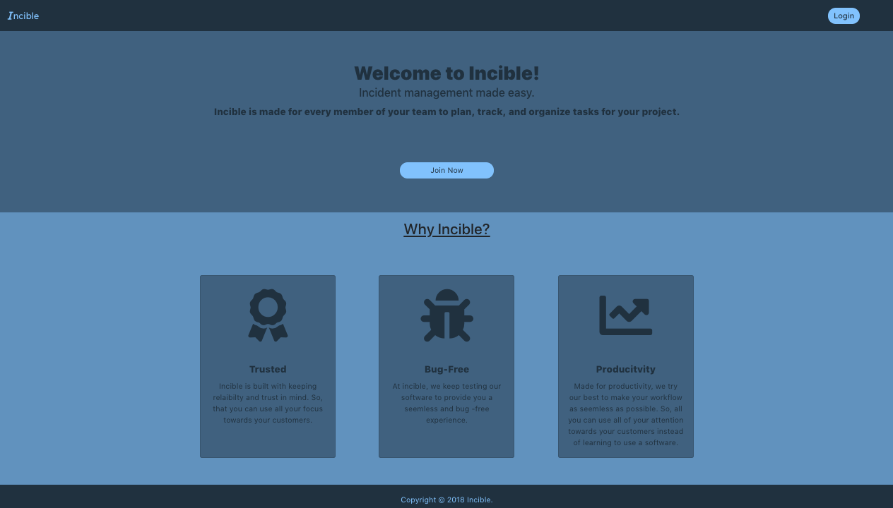
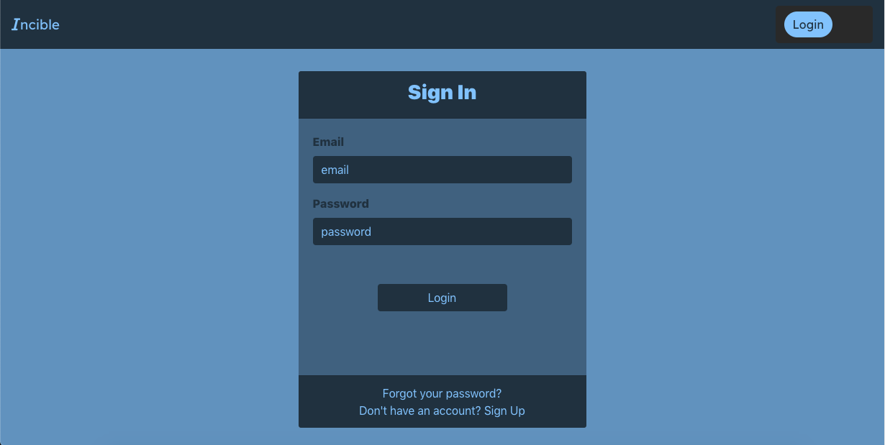
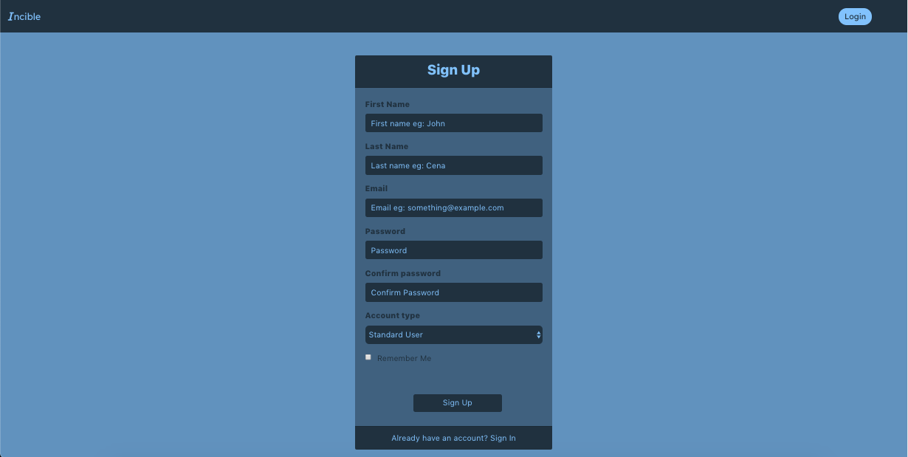
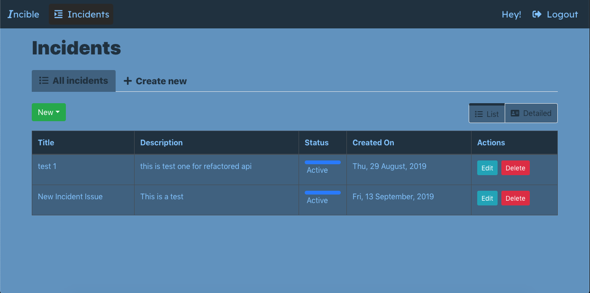
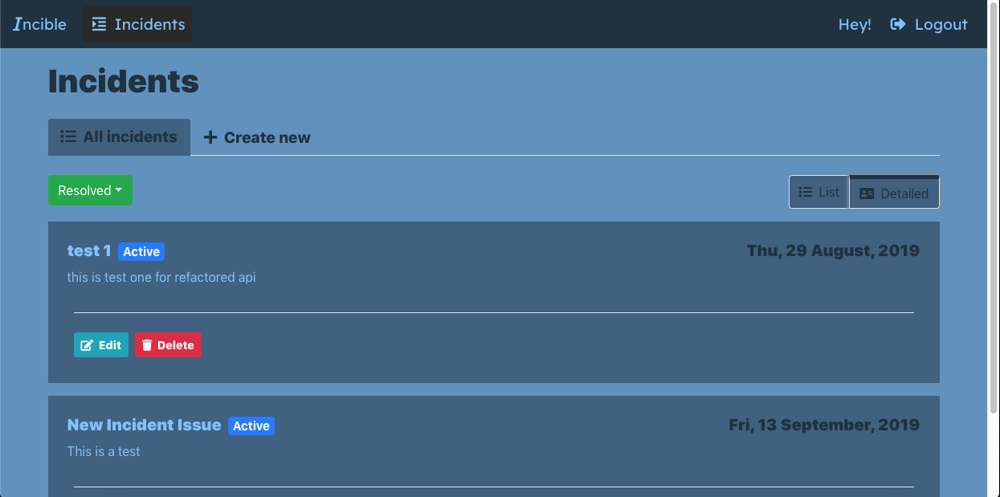
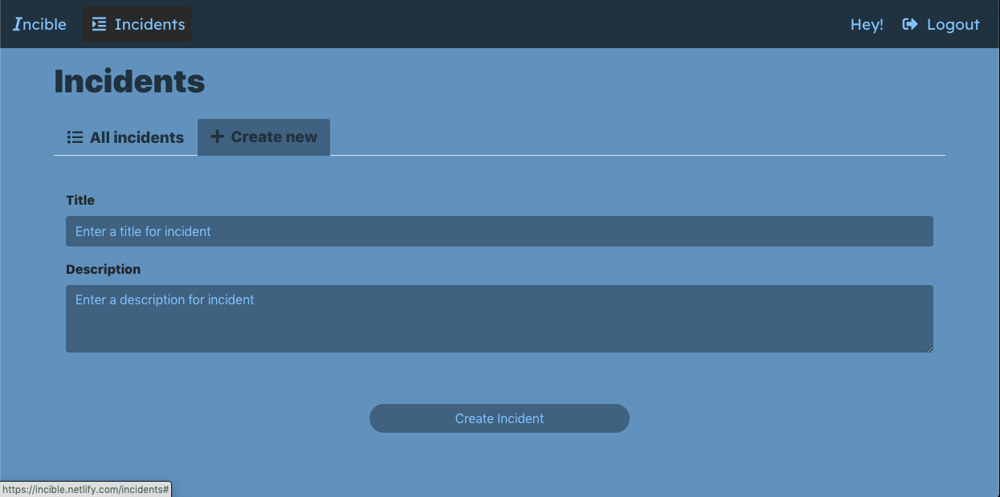
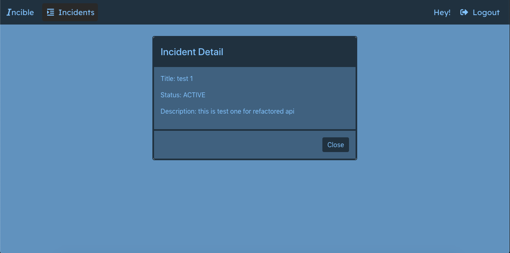

This project was bootstrapped with [Create React App](https://github.com/facebook/create-react-app).

## Incible Front-end

### Features
| Feature        | Purpose                                                             | Source             |
|----------------|---------------------------------------------------------------------|--------------------|
| API Calls      | API Calls for getting incidents, logging in                         | `users.action.js`  |
| SessionStorage | Usage of browser storage for storing token to avoid constant logins | `users.reducer.js` |
| Redux Thunk    | To perform functions and API requests asynchronously                | `store.js`         |
| Favicon | Add custom favicon icon converted online                                   | `favi.ico`              |
|Code Splitting                | One of the components is loaded on click, to decrease the initial bundle size |                    |
|                |                                                                     |                    |
|                |                                                                     |                    |

### Home Screen

### Log In

### Sign Up

###  Incident List

###  Incident List (Extended View)

### Create Incident

### Incident Details

